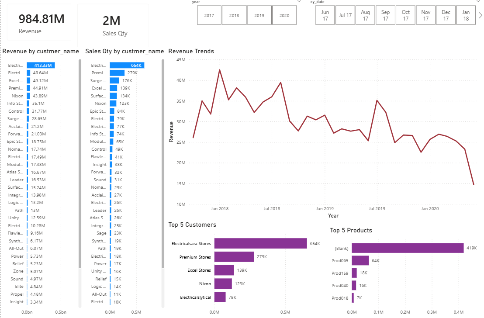

# Customer Revenue Analysis – Power BI

## Overview
This project analyzes customer revenue data to understand revenue distribution, customer contribution, and overall business performance. The goal was to build an end-to-end analytics workflow, from database extraction to an interactive Power BI dashboard—that enables stakeholders to quickly explore revenue trends and customer behavior.

---

## Data Architecture

### Data Source
- **Database:** MySQL  
- **Tables:**  
  - Customer  
  - Orders  
  - Order Details  
  - Payments  
- **Data Size:** Multi-table relational dataset representing customer transactions and revenue.

---

## Data Engineering & ETL (Power Query)
The ETL pipeline was built entirely within Power Query to ensure a reproducible data lifecycle:

- **Ingestion:** Direct connection to MySQL using native database connectors.  
- **Cleaning:** Handled null values, corrected data types, and removed duplicates.  
- **Transformation:** Standardized fields and created derived columns for precise revenue calculations.  
- **Modeling:** Established relationships across tables to support cross-functional analytics.

---

## Metrics & KPIs
The dashboard tracks performance through several high-level KPIs and granular metrics:

- **Total Revenue:** 984.81M (Total across all selected periods).  
- **Sales Quantity:** 2M units sold.  
- **Revenue Trends:** Time-series analysis showing performance peaks and troughs (e.g., peak revenue in Jan 2018).  
- **Top 5 Customers:** Ranking by volume (led by *Electricalsara Stores* at 654K).  
- **Top 5 Products:** Identification of high-volume SKUs.

---

## Dashboard Features
- **Interactive Slicers:** Filter data dynamically by Year (2017–2020) and Month (`cy_date`).  
- **Revenue Trends Line Chart:** Visualizes revenue fluctuations over time to identify seasonal patterns.  
- **Comparative Bar Charts:** Side-by-side comparison of *Revenue by Customer* vs. *Sales Quantity by Customer*.  
- **Drill-Down Capability:** Scrollable lists for comprehensive customer performance audits.  
- **Data Quality Indicators:** Identification of *“Blank”* product categories to highlight data entry gaps.

---

## Business Value
- **Identify High-Value Targets:** Pinpoint which customers drive the bulk of the revenue (e.g., Electricalsara Stores).  
- **Monitor Growth Trends:** Observe decline or growth phases to adjust sales strategies.  
- **Self-Service Analytics:** Empower stakeholders to get answers without writing SQL queries.  
- **Operational Efficiency:** Automated reporting reduces manual data consolidation efforts.

---

## Files in This Repository
- **Customer_Revenue_Dashboard.pbix** – The core Power BI dashboard file.  
- **/screenshots** – Visual previews of the dashboard.  
- **README.md** – Project documentation.

---

## How to Use
1. **Prerequisites:** Install Power BI Desktop.  
2. **Download:** Clone this repository or download the `.pbix` file.  
3. **Connection:** Open the file. If you wish to refresh the data, update the *Data Source Settings* with your MySQL credentials.  
4. **Explore:** Use the slicers at the top to filter by specific years or months.

---

## Tools & Technologies
- **Power BI:** Visualization and Dashboarding  
- **Power Query:** ETL and Data Transformation  
- **MySQL / SQL:** Source Database and Querying  
